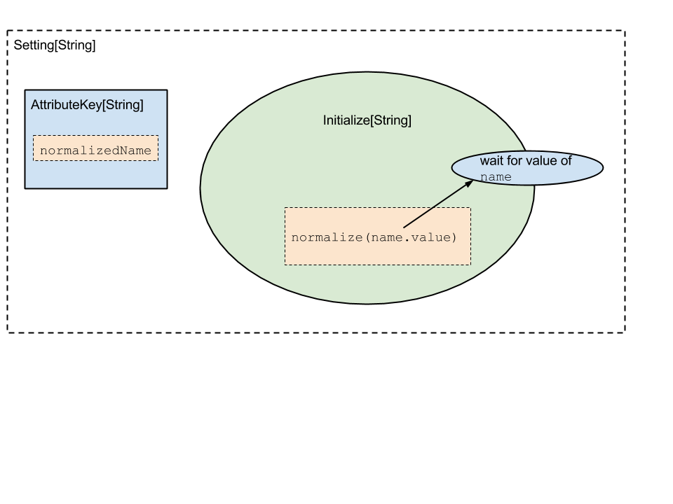

=================
 Core Principles
=================

This document details the core principles overarching sbt's design and code style.   Sbt's core principles can
be stated quite simply:

1. Everything should have a ``Type``, enforced as much as is practical.
2. Dependencies should be **explicit**.
3. Once learned, a concept should hold throughout **all** parts of sbt.
4. Parallel is the default.

With these principles in mind, let's walk through the core design of sbt.

Introduction to build state
===========================
This is the first piece you hit when starting sbt.  Sbt's command engine is the means by which
it processes user requests using the build state.  The command engine is essentially a means of applying
**state transformations** on the build state, to execute user requests.

In sbt, commands are functions that take the current build state (``sbt.State``) and produce the next state.  In
other words, they are essentially functions of ``sbt.State => sbt.State``.   However, in reality, Commands are
actually string processors which take some string input and act on it, returning the next build state.

The details of the command engine are covered in :doc:`the command engine section <Command-Engine>`.

So, the entirety of sbt is driven off the ``sbt.State`` class.   Since this class needs to be resilient in the
face of custom code and plugins, it needs a mechanism to store the state from any potential client.   In
dynamic languages, this can be done directly on objects.   

A naive approach in Scala is to use a ``Map<String,Any>``.  However, this vioaltes tennant #1: Everythign should have a `Type`.
So, sbt defines a new type of map called an ``AttributeMap``.   An ``AttributeMap`` is a key-value storage mechanism where
keys are both strings *and* expected `Type`s for their value.  

Here is what the typesafe ``AttributeKey`` key looks like ::

  sealed trait AttributeKey[T] {
    /** The label is the identifier for the key and is camelCase by convention. */
	def label: String
	/** The runtime evidence for `T` */
	def manifest: Manifest[T]
  }

These keys store both a `label` (``string``) and some runtime type information (``manifest``).  To put or get something on
the AttributeMap, we first need to construct one of these keys.  Let's look at the basic definition of the ``AttributeMap`` ::

  trait AttributeMap {
	/** Gets the value of type `T` associated with the key `k` or `None` if no value is associated. 
	* If a key with the same label but a different type is defined, this method will return `None`. */
	def get[T](k: AttributeKey[T]): Option[T]

	
	/** Adds the mapping `k -> value` to this map, replacing any existing mapping for `k`.
	* Any mappings for keys with the same label but different types are unaffected. */
	def put[T](k: AttributeKey[T], value: T): AttributeMap
  }

Now that there's a definition of what build state is, there needs to be a way to dynamically construct it.  In sbt, this is
done through the ``Setting[_]`` sequence.

Settings Architecture
=====================

A Setting represents the means of constructing the value of one particular ``AttributeKey[_]`` in the ``AttributeMap`` of build state.  A setting consists of two pieces:

1. The ``AttributeKey[T]`` where the value of the setting should be assigned.
2. An ``Initialize[T]`` object which is able to construct the value for this setting.

Sbt's initialization time is basically just taking a sequence of these ``Setting[_]`` objects and running their initialization objects and then storing the value into the ``AttributeMap``.   This means overwriting an exisitng value at a key is as easy as appending a
``Setting[_]`` to the end of the sequence which does so.

Where it gets interesting is that ``Initialize[T]`` can depend on other ``AttributeKey[_]``s in the build state.  Each ``Initialize[_]``
can pull values from any ``AttributeKey[_]`` in the build state's ``AttributeMap`` to compute its value.  Sbt ensures a few things
when it comes to ``Initialize[_]`` dependencies:

1. There can be no circular dependencies
2. If one ``Initialize[_]`` depends on another ``Initialize[_]`` key, then *all* associated ``Initialize[_]`` blocks for that key must
   have run before we load the value.

Let's look at what gets stored for the setting ::

  normalizedName := normalize(name.value)

.. Note: This image comes from a google drawing: https://docs.google.com/a/typesafe.com/drawings/d/1hvE89XVrQiXdSBsgaQgQGTmcO44EBZPg4_0WxKXU7Pw/edit
.. Feel free to request access to modify as appropriate.

Here, a ``Setting[_]`` is constructed that understands it depends on the value in the ``name`` AttributeKey.  Its initialize block first grabs the value of the ``name`` key, then runs the function normalize on it to compute its value.

This represents the core mechanism of how to construct sbt's build state.  Conceptually, at some point we have a graph of dependencies
and initialization functions which we can use to construct the first build state.   Once this is completed, we can then start to process
user requests.

Task Architecture
=================

The next layer in sbt is around these user request, or tasks.   When a user configures a build, they are defining a set of repeatable
tasks that they can run on their project.  Things like ``compile`` or ``test``.   These tasks *also* have a dependency graph, where
e.g. the ``test`` task requires that ``compile`` has run before it can successfully execute.

Sbt's defines a class ``Task[T]``.  The ``T`` type parameter represents the type of data returned by a task.  Remember the tenets of
sbt?  "All things have types" and "Dependencies are explicit" both hold true for tasks.   Sbt promotes a style of task dependencies that
is closer to functional programming:  Return data for your users rather than using shared mutable state.

Most build tools communciate over the filesystem, and indeed sbt, by necessity, does some of this.  However, for stable parallelization it is far better to keep tasks isolated on the filesystem and communicate directly through types.

Similarly to how a ``Setting[_]`` stores both dependencies and an initialization function, a ``Task[_]`` stores both its 
``Task[_]``dependencies and its behavior (a function).  

TODO - More on ``Task[_]``

TODO - Transition into ``InputTask[_]``, rehash Command

TODO - Tansition into Scope.