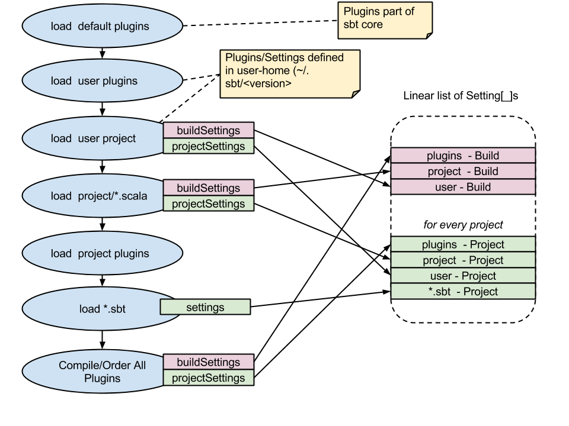

======================
Setting Initialization
======================

This page outlines the mechanisms by which sbt loads settings for a particular build, including the hooks where
users can control the ordering of everything.

As stated elsewhere, sbt constructs its initialization graph and task graph via ``Setting[_]`` objects.  A setting
is something which can take the values stored at other Keys in the build state, and generates a new value for
a particular build key.  Sbt converts all registered ``Setting[_]`` objects into a giant linear sequence and
*compiles* them into the a task graph.  This task graph is then used to execute your build.

All of sbt's loading semantics are contained within the `Load.scala <../../sxr/sbt/Load.scala.html>` file.  It is approximately the following:

The blue circles represent actions happening when sbt loads a project.  We can see that sbt performs the following actions in load:

1. Compile the user-level project (``~/.sbt/<version>/``)
   a. Load any plugins defined by this project  (``~/.sbt/<version>/plugins/*.sbt`` and ``~/.sbt/<version>/plugins/project/*.scala``)
   b. Load all settings defined (``~/.sbt/<version>/*.sbt`` and ``~/.sbt/<version>/plugins/*.scala``)
2. Compile the current project (``<working-directory/project``)
   a. Load all defined plugins (``project/plugins.sbt`` and ``project/project/*.scala``)
   b. Load/Compile the project (``project/*.scala``)
3. Load project *.sbt files (``build.sbt`` and friends).

Each of these loads defines several sequences of settings.  The diagram shows the two most important:

* ``buildSettings`` - These are settings defined to be ``in ThisBuild``.   They are initialized *once* for the build.
  You can add these, e.g. in ``project/build.scala`` ::

    object MyBuild extends Build {
      override val settings = ...
    }

* ``projectSettings`` - These are settings specific to a project.  They are specific to a *particular submodule* in the build.  A
  plugin may be contributing its settings to more than on project, in which case the values are duplicated for each project.
  You add project specific settings, eg. in ``project/build.scala`` ::

    object MyBuild extends Build {
      val test = project.in(file(".")).settings(...)
    }

After loading/compiling all the build definitions, sbt has a series of Seq[Setting[_]] that it must order.  As shown in the diagram,
the default inclusion order for sbt is:

1. All AutoPlugin settings
2. All settings defined in ``project/Build.scala``
3. All settings defined in the user directory (``~/.sbt/<verison>/*.sbt``)
4. All local configurations (``build.sbt``)

Controlling Initialization
==========================

The order which sbt uses to load settings is configurable at a *project* level.   This means that we can't control
the order of settings added to Build/Global namespace, but we can control how each project loads, e.g. plugins and ``.sbt`` files.
To do so, use the ``AddSettings`` class ::

	import sbt._
	import Keys._

	import AddSettings._

    object MyOwnOrder extends Build {
	  // here we load config from a txt file.
	  lazy val root = project.in(file(".")).autoSettings( autoPlugins, projectSettings, sbtFiles(file("silly.txt")) )
	}

In the above project, we've modified the order of settings to be:

1. All AutoPlugin settings.
2. All settings defined in the ``project/Build.scala`` file (shown above).
3. All settings found in the ``silly.txt`` file.

What we've excluded:

* All settings from the user directory (``~/.sbt/<verison>``)
* All ``*.sbt`` settings.

The AddSettings object provides the following "groups" of settings you can use for ordering:

``autoPlugins``
  All the ordered settings of plugins after they've gone through dependency resolution
``projectSettings``
  The full sequence of settings defined directly in ``project/*.scala`` builds.
``sbtFiles(*)``
  Specifies the exact setting DSL files to include (files must use the ``.sbt`` file format)
``userSettings``
  All the settings defined in the user directory ``~/.sbt/<version>/``.
``defaultSbtFiles``
  Include all local ``*.sbt`` file settings.

*Note: Be very careful when reordering settings.  It's easy to accidentally remove core functionality.*