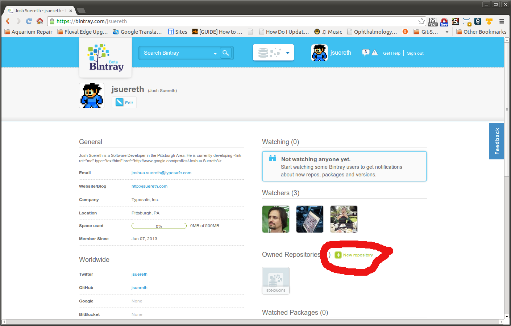
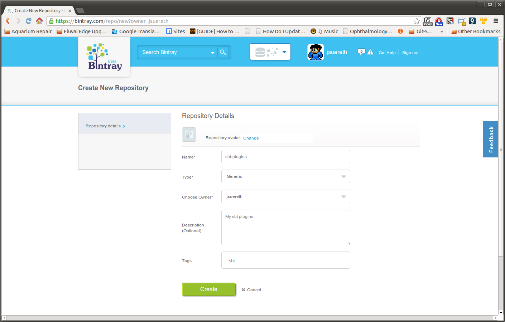
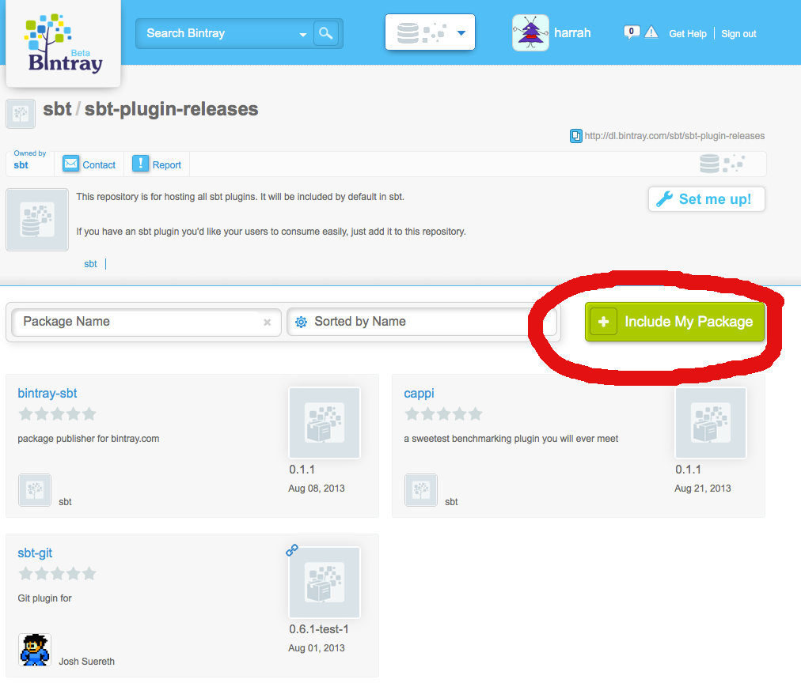
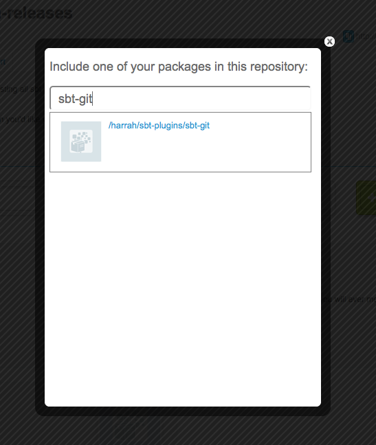
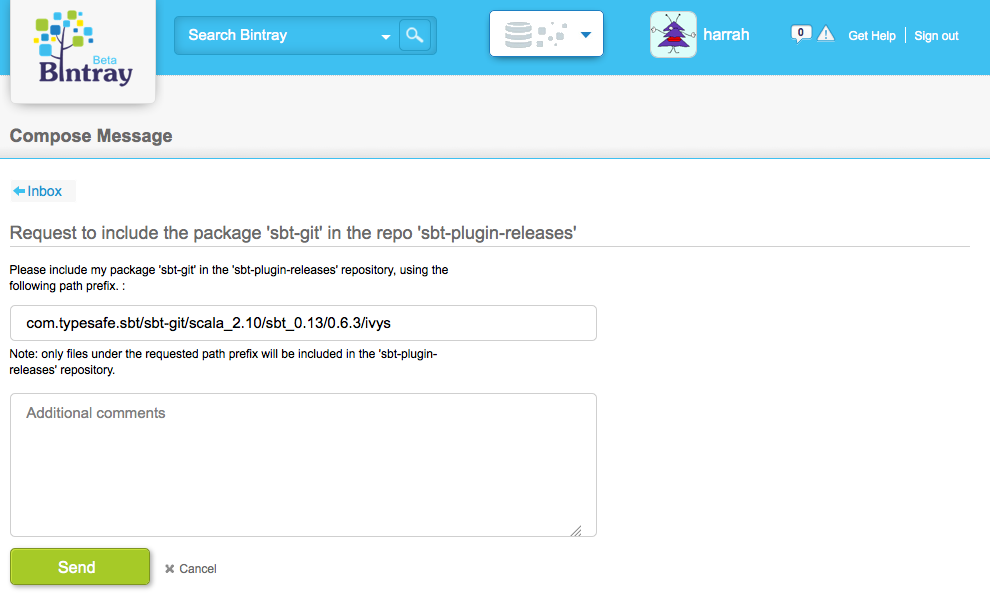
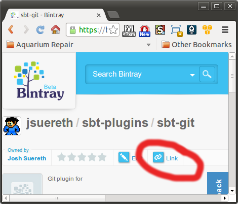
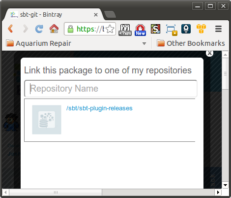

===================
Bintray For Plugins
===================

**This is currently in Beta mode.**

sbt hosts their community plugin repository on `Bintray <http://bintray.com/sbt>`_.  Bintray is a repository hosting site, similar to github, which allows users to contribute their own plugins, while sbt can aggregate them together in a common repository.

This document walks you through the means to create your own repository for hosting your sbt plugins and then linking them into the sbt shared repository.  This will make your plugins available for all sbt users without additonal configuration (besides declaring a dependency on your plugin).

To do this, we need to perform the following steps:

Create an account on Bintray
============================
First, go to http://bintray.com.  Click on the sign in link on the top left, and then the sign up button.

*Note: If you had an account on repo.scala-sbt.org previous, please use the same email address when you create this account.*

Create a repository for your sbt plugins
========================================
Now, we'll create a repository to host our personal sbt plugins.   In bintray, create a generic repository called ``sbt-plugins``.

First, go to your user page and click on the ``new repository`` link:

You should see the following dialog:

Fill it out similarly to the above image, the settings are:

Name
  sbt-plugins
Type
  Generic
Desc
  My sbt plugins
Tags
  sbt

Once this is done, you can begin to configure your sbt-plugins to publish to bintray.

Add the bintray-sbt plugin to your build.
========================================

First, add the bintray-sbt to your plugin build.

First, create a ``project/bintray.sbt`` file  ::

    resolvers += Resolver.url(
      "bintray-sbt-plugin-releases",
       url("http://dl.bintray.com/content/sbt/sbt-plugin-releases"))(
           Resolver.ivyStylePatterns)

    addSbtPlugin("me.lessis" % "bintray-sbt" % "0.1.1")

Next, a make sure your  ``build.sbt`` file has the following settings ::

    import bintray.Keys._
    
    sbtPlugin := true
    
    name := "<YOUR PLUGIN HERE>"
    
    organization := "<INSERT YOUR ORG HERE>"
    
    version := "<YOUR PLUGIN VERSION HERE>"
    
    publishMavenStyle := false
    
    bintrayPublishSettings
    
    repository in bintray := "sbt-plugins"
    
    // This is an example.  bintray-sbt requires licenses to be specified 
    // (using a canonical name).
    licenses += ("Apache-2.0", url("http://www.apache.org/licenses/LICENSE-2.0.html"))
    
    bintrayOrganization in bintray := None

Make sure your project has a valid license specified, as well as unique name and organization.

Make a release
==============

Once your build is configured, open the sbt console in your build and run:

.. code-block:: console

     sbt> publish

The plugin will ask you for your credentials.  If you don't know where they are, you can find them on `Bintray <http://bintray.com>`_.

1. Login to the website with your credentials.
2. Click on your username
3. Click on edit profile
4. Click on API Key

This will get you your password.   The bintray-sbt plugin will save your API key for future use.

*NOTE: We have to do this before we can link our package to the sbt org.*

Linking your package to the sbt organization
============================================

Now that your plugin is packaged on bintray, you can include it in the community sbt repository.  To do so, go to the `Community sbt repository <https://bintray.com/sbt/sbt-plugin-releases>`_ screen.

1. Click the green ``include my package`` button and select your plugin.

2. Search for your plugin by name and click on the link.

3. Your request should be automatically filled out, just click send

4. Shortly, one of the sbt repository admins will approve your link request.

From here on, any releases of your plugin will automatically appear in the community sbt repository.  Congratulations and thank you so much for your contributions!

Linking your package to the sbt organization (sbt org admins)
=============================================================
If you're a member of the sbt organization on bintray, you can link your package to the sbt organization, but via a different means.  To do so, first navigate to the plugin you wish to include and click on the link button:

After clicking this you should see a link like the following:

Click on the sbt/sbt-plugin-releases repository and you're done!   Any future releases will be included in the sbt-plugin repository.

Summary
=======

After setting up the repository, all new releases will automatically be included the sbt-plugin-releases repository, available for all users.  When you create a new plugin, after the initial release you'll have to link it to the sbt community repository, but the rest of the setup should already be completed.   Thanks for you contributions and happy hacking.
