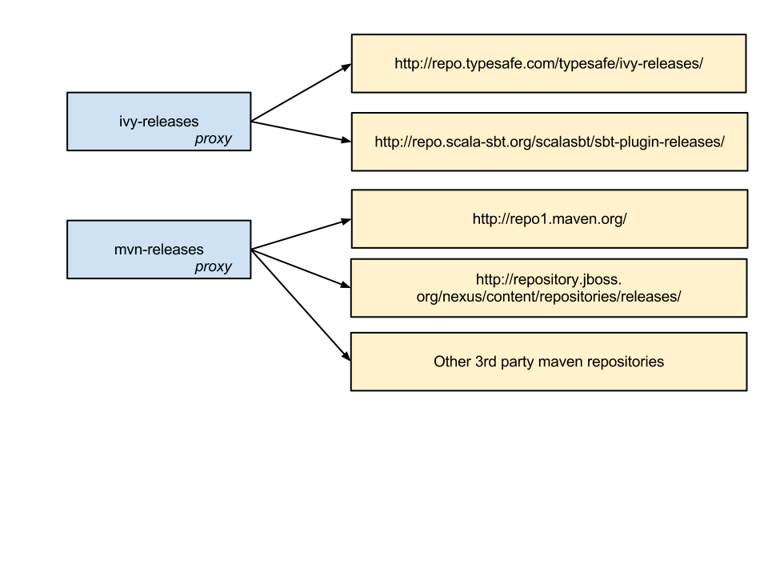

==================
Proxy Repositories
==================

It's often the case that users wish to set up a maven/ivy proxy
repository inside their corporate firewall, and have developer
sbt instances resolve artifacts through such a proxy.  Let's detail
what exact changes must be made for this to work.

Overview
========

The situation arises when many developers inside an organization
are attempting to resolve artifacts.  Each developer's machine
will hit the internet and download an artifact, regardless of
whether or not another on the team has already done so.  Proxy
repositories provide a single point of remote download for an
organization.  In addition to control and security concerns, 
Proxy repositories are primarily important for increased speed
across a team.

.. image:: proxy-cloud-setup.png

There are many good proxy repository solutions out there, with
the big three being (in alphabetical order):

* Archiva_
* Artifactory_
* Nexus_

Once you have a proxy repository installed and configured,
then it's time to configure sbt for your needs.  Read the
note at the bottom about proxy issues with ivy repositories.

sbt Configuration
=================

sbt requires configuration in two places to make use of a
proxy repository.   The first is the ``~/.sbt/repositories``
file, and the second is the launcher script.

``~/.sbt/repositories``
-----------------------
The repositories file is an external configuration for the Launcher.  
The exact syntax for the configuration file is detailed in the 
:doc:`/Detailed-Topics/Launcher`.   

Here's an example config:

.. code-block:: ini

    [repositories]
      local
      my-ivy-proxy-releases: http://repo.company.com/ivy-releases/, [organization]/[module]/(scala_[scalaVersion]/)(sbt_[sbtVersion]/)[revision]/[type]s/[artifact](-[classifier]).[ext]
      my-maven-proxy-releases: http://repo.company.com/maven-releases/

This example configuration has three repositories configured for sbt.

The first resolver is ``local``, and is used so that artifacts pushed
using ``publish-local`` will be seen in other sbt projects.

The second resolver is ``my-ivy-proxy-releases``.   This repository
is used to resolve sbt *itself* from the company proxy repository,
as well as any sbt plugins that may be required.   Note that the
ivy resolver pattern is important, make sure that yours matches the
one shown or you may not be able to resolve sbt plugins.

The final resolver is ``my-maven-proxy-releases``.  This repository
is a proxy for all standard maven repositories, including
maven central.

Launcher Script
---------------------
The sbt launcher supports two configuration options that
allow the usage of proxy repositories.  The first is the
``sbt.override.build.repos`` setting and the second is the 
``sbt.repository.config`` setting.

``sbt.override.build.repos``
~~~~~~~~~~~~~~~~~~~~~~~~~~~~
This setting is used to specify that all sbt project added resolvers 
should be ignored in favor of those configured in the ``repositories``
configuration.  Using this with a properly configured
``~/.sbt/repositories`` file leads to only your proxy repository
used for builds.

It is specified like so:

.. code-block:: console

    -Dsbt.override.build.repos=true

``sbt.repository.config``
~~~~~~~~~~~~~~~~~~~~~~~~~
If you are unable to create a ``~/.sbt/repositories`` file, due
to user permission errors or for convenience of developers, you
can modify the sbt start script directly with the following:

.. code-block:: console

    -Dsbt.repository.config=<path-to-your-repo-file>

This is only necessary if users do not already have their own default
repository file.

Proxying Ivy Repositories
=========================
The most common mistake made when setting up a proxy repository for
sbt is the attempting to *merge* both *maven* and *ivy* repositories
into the *same* proxy repository.   While some repository managers will
allow this, it's not recommended to do so.

Even if your company does not use ivy, sbt uses a custom layout to
handle binary compatibility constraints of its own plugins.   To ensure
that these are resolved correctly, simple set up two virtual/proxy 
repositories,  one for maven and one for ivy.  

Here's an example setup:

.. _Archiva: http://archiva.apache.org/
.. _Artifactory: http://www.jfrog.com/home/v_artifactory_opensource_overview
.. _Nexus: http://www.sonatype.org/nexus/

